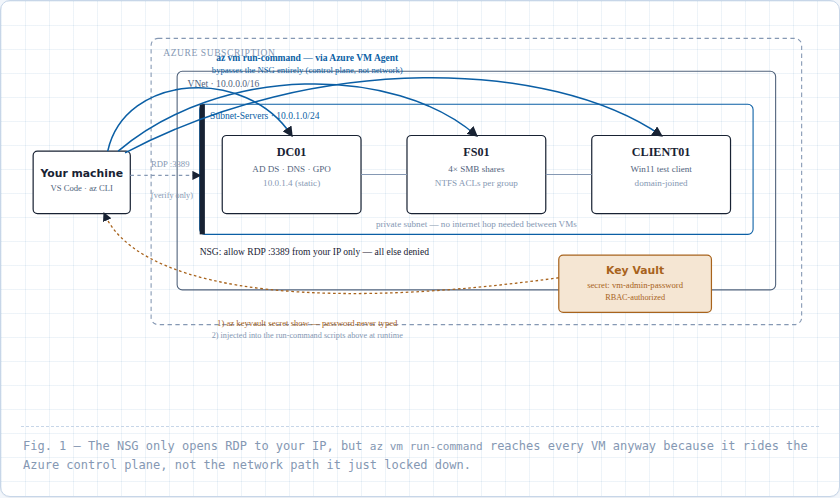

# NTFS File Server Lab

Active Directory, NTFS permissions, and SMB file services — deployed on Azure with Terraform, then configured with PowerShell driven entirely through the Azure VM Agent's control-plane channel (`az vm run-command`), so it all works even with the network locked down to a single inbound RDP rule.

This is Lab 1 of a small Azure series (NTFS File Server → RBAC → Azure Update Manager). It was built once by hand, then torn down and rebuilt completely from scratch as a repetition exercise — this repo reflects that second, verified build.

## Why this lab

Controlling who can read or write which files is one of the oldest problems in enterprise IT, and one of the most common interview topics for a sysadmin role. The standard answer — a Windows file server, backed by Active Directory security groups, enforced with NTFS permissions — is still what most organizations run today. This lab builds that pattern from scratch and proves it actually works, by logging in as four different test identities and confirming each one gets exactly the access their role should have, no more and no less.

## Architecture



- **DC01** — Domain Controller. Runs AD DS (Active Directory Domain Services) + DNS, owns identity for the domain (`lab.local`). Static private IP (`10.0.1.4`) so DNS never breaks after a reboot, and so other VMs' DNS client settings — which point at that IP directly — never lose the server they're relying on.
- **FS01** — File Server. Hosts the `CompanyData` SMB (Server Message Block) share, with `Finance` and `HR` subfolders, each locked down with NTFS permissions scoped to specific security groups.
- **CLIENT01** — Windows 11 workstation, domain-joined. Where test identities log in over RDP to exercise the full permission chain.
- **NSG** (Network Security Group) — a single inbound rule: RDP (3389) from one specific IP. Everything else is denied by Azure's implicit default rule.
- **Key Vault** — RBAC-authorized. Holds the VM admin password, retrieved at deploy/run time by whichever identity is running `az login` — never typed into a script, a CLI argument, or committed to this repo.

## What's inside

```
azure-ntfs-file-server-lab/
├── terraform/
│   ├── versions.tf, backend.tf, variables.tf, main.tf, keyvault.tf, outputs.tf
│   ├── terraform.tfvars.example   ← safe to commit
│   └── .gitignore                 ← keeps the real tfvars/tfstate out of git
├── scripts/
│   ├── 00-promote-dc.ps1
│   ├── 01-join-domain.ps1
│   ├── 02-create-ous.ps1
│   ├── 03-create-groups.ps1
│   ├── 04-create-users.ps1
│   ├── 05-create-share-and-permissions.ps1
│   └── 06-add-rdp-users.ps1
└── docs/
    ├── architecture-diagram.png
    └── NTFS-Lab-Terraform-File-Reference.pdf   ← file-by-file explanation of every .tf file
```

## Built with

Terraform (`azurerm`, `random`, `time` providers) · Azure CLI · PowerShell · Azure Key Vault (RBAC model) · `az vm run-command`

## Deploying it

1. Prerequisites: Terraform ≥ 1.5.0, Azure CLI, an Azure subscription.
2. One-time remote state bootstrap (resource group + storage account + blob container) — see the comment block at the top of `terraform/backend.tf`.
3. `az login`
4. From `terraform/`: copy `terraform.tfvars.example` → `terraform.tfvars`, fill in your values (your public IP, a globally-unique Key Vault name), and set `$env:TF_VAR_admin_password` in your shell — never in a file.
5. `terraform init && terraform plan && terraform apply`
6. Run `scripts/00` through `scripts/06` in order against the right VM (see each script's header comment), via `az vm run-command invoke`. `00` and `02`-`06` target DC01 or FS01/CLIENT01 as noted; `01` runs against FS01 and CLIENT01 individually.
7. RDP into CLIENT01 and verify manually (see below).

## Verification

Four test identities (all sharing one lab password pulled from Key Vault — fine for a throwaway lab, not for anything real):

| Login as | Access | Expected | Why |
|---|---|---|---|
| `LAB\alice.finance` | `\\FS01\CompanyData\Finance` | Read only | Member of `GG-Finance-ReadOnly` only |
| `LAB\alice.finance` | `\\FS01\CompanyData\HR` | Denied | Not in either HR group |
| `LAB\brian.finance` | `\\FS01\CompanyData\Finance` | Full read/edit/create/delete | Member of both `GG-Finance-ReadOnly` **and** `GG-Finance-Modify` — Allows from multiple groups combine (cumulative), so his effective access is the union of both |
| `LAB\carla.hr` | `\\FS01\CompanyData\HR` | Read only | Member of `GG-HR-ReadOnly` |
| `LAB\david.hr` | `\\FS01\CompanyData\HR` | Full control, including managing permissions | Member of `GG-HR-FullControl` |

All confirmed manually via RDP against the live build.

## Troubleshooting log

Real errors hit rebuilding this, kept here instead of cleaned away — a writeup that only shows the working path teaches less than one that shows what actually went wrong:

- **`versions.tf` constraint operators** — used `>=` instead of `~>` on provider version pins (providers want the pessimistic operator to guard against breaking changes on `terraform init`); then over-corrected `required_version` itself to `~> 1.5.0`, which would have broken `init` against a newer installed Terraform CLI. `required_version` wants `>=` — Terraform's CLI keeps strong backward compatibility across 1.x, providers don't.
- **Duplicate `azurerm_network_interface "fs01"` block** in `main.tf` — a plain copy-paste duplicate, caught by Terraform's own "duplicate resource configuration" error.
- **NIC creation race condition (`PrivateIPAddressIsAllocated`)** — DC01's NIC requests a specific Static address; FS01/CLIENT01's NICs ask for Dynamic ("whatever's free"). With no dependency between them, Terraform creates all three in parallel, and a Dynamic NIC finishing first can grab DC01's address before its Static request lands. Fixed with an explicit `depends_on` forcing the Dynamic NICs to wait for DC01's NIC. **Gotcha that bit twice:** `depends_on` only orders *new* resource creation — it does nothing to a NIC that already exists in Terraform's state holding the contested address. The already-created NIC had to be deleted (VM first, since a NIC can't be deleted while attached to a running VM — `NicInUse` — then the NIC) before the fix could actually take effect.
- **`OSProvisioningTimedOut` on CLIENT01** — the Windows 11 guest agent didn't report "ready" within Azure's timeout window (~40 minutes on the first hit). Isolated to the one VM on the `MicrosoftWindowsDesktop`/`windows-11` image family — DC01 and FS01, both Windows Server, never hit it. Resolved by simply retrying; succeeded in ~32 minutes on the second attempt.
- **`az vm run-command invoke --scripts "@file.ps1"` silently sending literal text instead of file content** — if the exact filename isn't found from the current directory, Azure CLI gives up loading it and passes the raw string `@file.ps1` to the VM as the script itself, which PowerShell then fails to parse with a confusing "splatting operator" error — no "file not found" message anywhere. The actual cause both times it happened here: a plain typo in a filename (`00-promte-dc.ps1`), confirmed with `dir` rather than guessed at.
- **Trusting `"Provisioning succeeded"` instead of checking the actual result** — the RunCommand extension reporting success only means the script *launched*, not that its own logic succeeded. The first pass through `00-promote-dc.ps1` "succeeded" by that measure while never actually promoting DC01 (the typo above), and the mistake propagated into a chain of confusing downstream DNS/domain-join failures before it was caught by checking DC01 directly.

## What's next

Lab 2 (Azure RBAC, scoped to FS01) and an Azure Update Manager lab (patch compliance) round out this series — both standalone builds, not yet started as of this writeup.

## Reflection

Most of the real friction here wasn't Active Directory or NTFS concepts — those held up fine on the second pass. It was verification discipline: a command reporting success and a script actually working turned out to be two different claims, and conflating them once was enough to send an hour of troubleshooting down the wrong path. Checking the actual resulting state after every step, not just the exit status of the command that produced it, is the habit that this rebuild reinforced the most.
